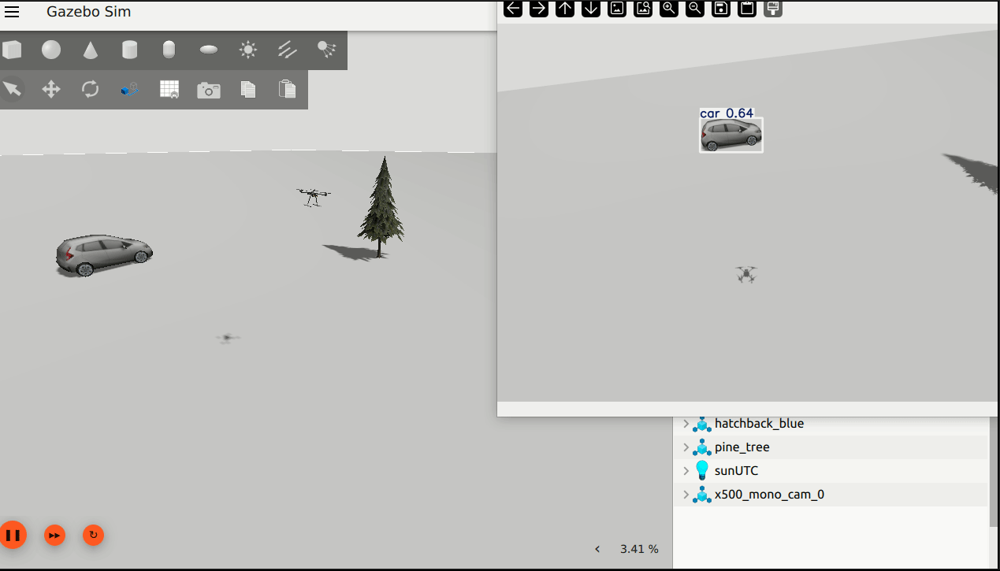

# 🚁 PX4 ROS2 Drone Vision

## 📌 Project Overview

This project implements a **ROS2 (Python) + PX4 offboard control + Gazebo camera perception pipeline** for autonomous drone simulation.

It extends a waypoint-based PX4 offboard autonomy foundation with **vision capabilities**, including:

- camera integration from Gazebo into ROS2
- live image visualization
- OpenCV-based image processing
- color-based object detection
- YOLO-based object detection

The system is designed with a modular robotics architecture: low-level PX4 flight control is separated from higher-level mission logic and vision processing. This makes the project easier to understand, extend, and reuse for future perception-driven autonomy tasks such as target tracking and mode switching.

---

## 🎥 Demo

### Autonomous mission + color detection


### YOLO detection


---

## ✨ Features

- ✅ PX4 SITL + ROS2 integration using Micro XRCE-DDS
- ✅ Offboard control via ROS2 Python
- ✅ Autonomous square waypoint mission
- ✅ Gazebo camera sensor integrated with PX4 simulation
- ✅ Gazebo → ROS2 image bridging using `ros_gz_bridge`
- ✅ Live image visualization with OpenCV
- ✅ Basic OpenCV image processing:
  - grayscale
  - Gaussian blur
  - Canny edge detection
- ✅ Color-based object detection using HSV thresholding and contours
- ✅ YOLO-based object detection on live drone camera feed
- ✅ Modular node-based ROS2 architecture
- ✅ YAML-based parameter configuration
- ✅ Launch-based workflow for camera and detection pipelines

---

## 🧠 System Architecture

The project is composed of two main layers:

### 1. Flight autonomy layer
Handles drone control and mission execution.

- **`offboard_control.py`**
  - PX4 offboard heartbeat
  - trajectory setpoint publishing
  - arm / mode switching / landing commands
  - simplified mission interface for higher-level nodes

- **`mission_planner.py`**
  - high-level mission state machine
  - takeoff
  - waypoint sequencing
  - landing request

### 2. Vision / perception layer
Handles the camera stream and visual processing.

- **`image_view_node.py`**
  - subscribes to camera image topic
  - displays live camera feed

- **`image_processor.py`**
  - performs basic OpenCV processing
  - grayscale, blur, edge detection

- **`color_detector.py`**
  - detects colored targets using HSV masking
  - extracts contour and target center
  - visualizes detection mask and target overlay

- **`yolo_detector.py`**
  - runs YOLO object detection on live camera frames
  - displays bounding boxes and class labels

---

## 🔁 Data Flow

```mermaid
flowchart LR
    MP[mission_planner.py<br/>High-level mission logic]
    OC[offboard_control.py<br/>PX4 interface]
    PX4[PX4 SITL Autopilot]
    GZ[Gazebo Simulation]

    CAM[Gazebo Camera Sensor]
    BR[ros_gz_bridge]
    IV[image_view_node.py]
    IP[image_processor.py]
    CD[color_detector.py]
    YOLO[yolo_detector.py]

    MP -- /mission/target_position --> OC
    MP -- /mission/land --> OC
    OC -- /mission/current_position --> MP

    OC -- /fmu/in/offboard_control_mode --> PX4
    OC -- /fmu/in/trajectory_setpoint --> PX4
    OC -- /fmu/in/vehicle_command --> PX4

    PX4 -- /fmu/out/vehicle_local_position --> OC
    PX4 -- /fmu/out/vehicle_status_v1 --> OC

    PX4 --- GZ
    GZ --> CAM
    CAM --> BR
    BR --> IV
    BR --> IP
    BR --> CD
    BR --> YOLO
````

---

## ⚙️ Dependencies

* ROS2 Humble
* PX4 Autopilot (SITL, v1.16.0 recommended)
* Gazebo Harmonic / `gz`
* Micro XRCE-DDS Agent
* QGroundControl
* `px4_msgs`
* `ros_gz_bridge`
* `cv_bridge`
* OpenCV (`python3-opencv`)
* Ultralytics YOLO

---

## 🚀 How to Run

### 1. Source environment

```bash
source ~/drone_ws/env_px4.sh
```

Example environment script:

```bash
source ~/drone_ws/install/setup.bash
export ROS_DOMAIN_ID=0
unset ROS_LOCALHOST_ONLY
```

---

### 2. Start Micro XRCE-DDS Agent

```bash
MicroXRCEAgent udp4 -p 8888
```

---

### 3. Start QGroundControl

```bash
./QGroundControl.AppImage
```

---

### 4. Start PX4 SITL with camera model

#### Downward-facing camera

```bash
cd ~/PX4-Autopilot
make px4_sitl gz_x500_mono_cam_down
```

#### Forward/side camera

```bash
cd ~/PX4-Autopilot
make px4_sitl gz_x500_mono_cam
```

---

## 🚁 Run the autonomous mission

```bash
ros2 launch drone_vision_py mission.launch.py
```

---

## 📷 Run camera view

```bash
ros2 launch drone_vision_py camera_view.launch.py
```

---

## 🧪 Run image processing

```bash
ros2 launch drone_vision_py image_processor.launch.py
```

---

## 🎯 Run color-based detection

```bash
ros2 launch drone_vision_py color_detector.launch.py
```

This node:

* thresholds the selected HSV color range
* extracts the largest contour
* computes target center
* visualizes detection mask and overlay

---

## 🧠 Run YOLO detection

```bash
ros2 launch drone_vision_py yolo_detector.launch.py
```

This node:

* subscribes to the live ROS2 camera stream
* runs YOLO inference on incoming frames
* displays bounding boxes and labels

> Note: the default pretrained YOLO model works best for common object classes and more side-facing views than top-down views.

---

## 🗺️ Mission Configuration

Mission parameters are defined in YAML files under:

```text
config/
```

Example:

```yaml
mission_planner_node:
  ros__parameters:
    takeoff_altitude: -5.0
    position_tolerance: 0.5
    hold_count_required: 10
    waypoints: [0.0, 0.0, -5.0, 5.0, 0.0, -5.0, 5.0, 5.0, -5.0, 0.0, 5.0, -5.0]
```

### Waypoint Format

Waypoints are defined in **PX4 local NED frame**:

```text
[x1, y1, z1, x2, y2, z2, ...]
```

Each group of 3 values represents one waypoint.

* `x` → North
* `y` → East
* `z` → Down (negative = altitude above origin)

---

## 🎨 Color Detection Details

The color detector uses:

* BGR → HSV conversion
* `cv2.inRange()` thresholding
* contour extraction
* centroid computation using image moments

It visualizes:

* detected mask
* contour outline
* target center
* image center
* image-space error from target to center

This provides a clean first step toward visual tracking.

---

## 🧠 YOLO Detection Details

The YOLO detector uses the Ultralytics Python API to run real-time object detection on the drone camera feed.

Current implementation includes:

* ROS2 image subscription
* `cv_bridge` conversion
* YOLO inference
* rendered output with bounding boxes

This serves as the perception foundation for future capabilities such as:

* class filtering
* target selection
* target tracking
* behavior switching between mission mode and tracking mode

---

## 📁 Project Structure

```text
drone_vision_py/
├── config/
│   ├── offboard_params.yaml
│   ├── mission_params.yaml
│   ├── camera_params.yaml
│   ├── image_processor_params.yaml
│   ├── color_detector_params.yaml
│   └── yolo_detector_params.yaml
├── launch/
│   ├── mission.launch.py
│   ├── camera_view.launch.py
│   ├── image_processor.launch.py
│   ├── color_detector.launch.py
│   └── yolo_detector.launch.py
├── drone_vision_py/
│   ├── offboard_control.py
│   ├── mission_planner.py
│   ├── image_view_node.py
│   ├── image_processor.py
│   ├── color_detector.py
│   └── yolo_detector.py
├── package.xml
├── setup.py
└── README.md
```

---

## 🔧 Key Concepts Demonstrated

* ROS2 publishers, subscribers, timers, and launch files
* PX4 offboard control through ROS2
* PX4 local NED frame waypoint missions
* Gazebo camera sensor integration
* `ros_gz_bridge` usage for image transport
* `cv_bridge` image conversion
* OpenCV image processing
* HSV-based color segmentation
* contour-based target extraction
* YOLO-based visual object detection
* modular robotics software architecture

---

## 🚧 Current Limitations

* Gazebo camera topic names are currently tied to the selected PX4 camera model
* YOLO performance depends heavily on viewpoint and visible object classes
* pretrained YOLO is better suited to side-view scenes than top-down drone imagery
* perception outputs are currently visualized, but not yet fed back into flight behavior

---

## 🚀 Future Work

Planned next steps for this project:

* publish detection outputs as ROS2 topics
* clean shared camera topic configuration through a single YAML source
* switch between mission mode and tracking mode
* visual target tracking
* detection-driven control
* improved simulation worlds with richer objects and environments
* custom-trained YOLO model for aerial/top-down views

---

## 🏁 Summary

This project demonstrates a complete **PX4 + ROS2 drone vision pipeline** in simulation, combining:

* autonomous waypoint flight
* camera integration
* image transport into ROS2
* OpenCV-based perception
* YOLO-based object detection

It serves as a strong foundation for future work in perception-driven autonomy, tracking, and intelligent drone behavior.
